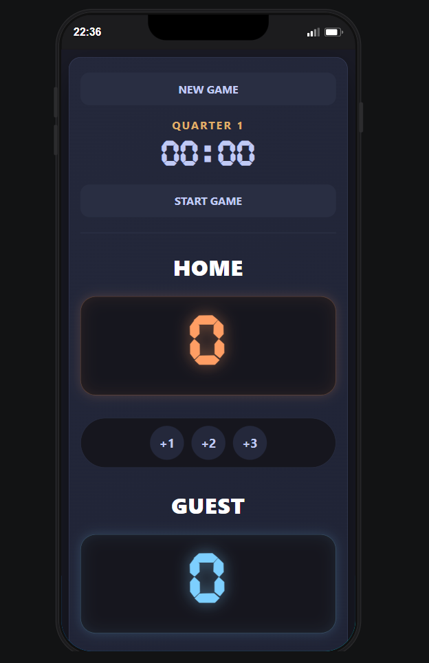
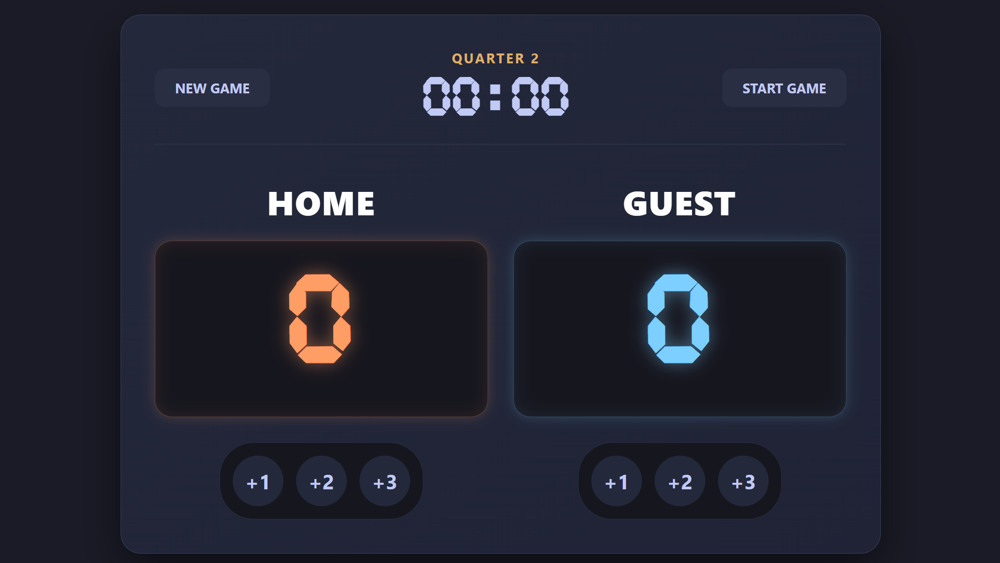

# 🏀 Basketball Scoreboard 

A responsive basketball scoreboard web application built with **HTML**, **CSS**, and **JavaScript**.

## ✨ Features

* Live basketball scoreboard
* Add points for Home and Guest teams
* Real-time game timer
* Automatic quarter updates
* New game reset button
* Responsive design for desktop, tablet, and mobile
* Custom digital timer font
* Modern UI design
* Keyboard accessible buttons
* Improved accessibility support

---

# 🚀 Technologies Used

* HTML5
* CSS3
* JavaScript 

---

# 📱 Responsive Design

The project supports:

* Desktop
* Tablet
* Mobile devices

Media queries were used to create a fully responsive layout.

---

# ⏱ Timer Features

* Start game timer
* Automatic second and minute updates
* Quarter progression:

  * Quarter 1 → 0–12 minutes
  * Quarter 2 → 13–24 minutes
  * Quarter 3 → 25–36 minutes
  * Quarter 4 → 37–48 minutes
* Automatically stops at 48 minutes

---

# ♿ Accessibility Improvements

* Semantic HTML structure
* Accessible button labels
* Keyboard-friendly controls
* Live region updates using `aria-live`
* Responsive touch-friendly buttons

---

# 📂 Project Structure

```bash
project-folder/
│
├── index.html
├── styles.css
├── index.js
└── README.md
```

---

# 🎨 Font Used

* Cursed Timer ULiL

---

# 🛠 Future Improvements

* Add pause/resume timer
* Add shot clock
* Add sound effects
* Store match history
* Dark/light theme toggle
* Team foul tracking

---

# 📸 Preview

Basketball Scoreboard Pro interface with:

* live timer
* quarter tracking
* responsive scoreboard
* animated UI


---


# 🔗 Live Demo
https://lets-count-basketball-score.netlify.app/
---

# 👨‍💻 Author

Created by [Peter Paing]


